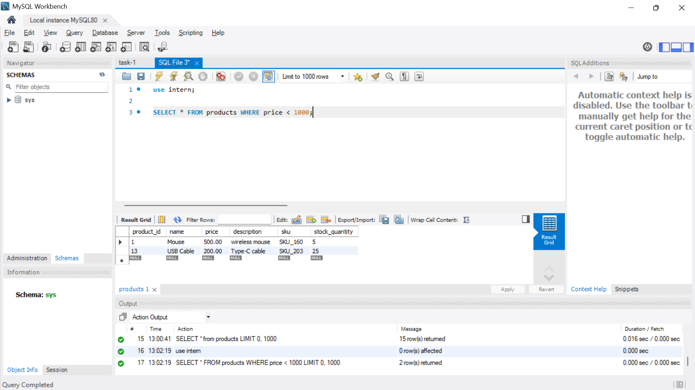
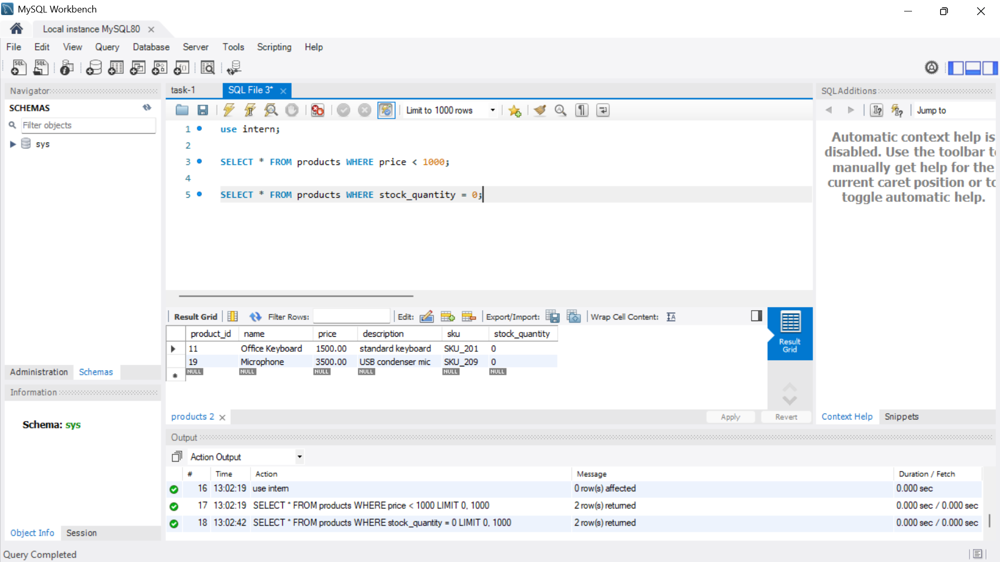
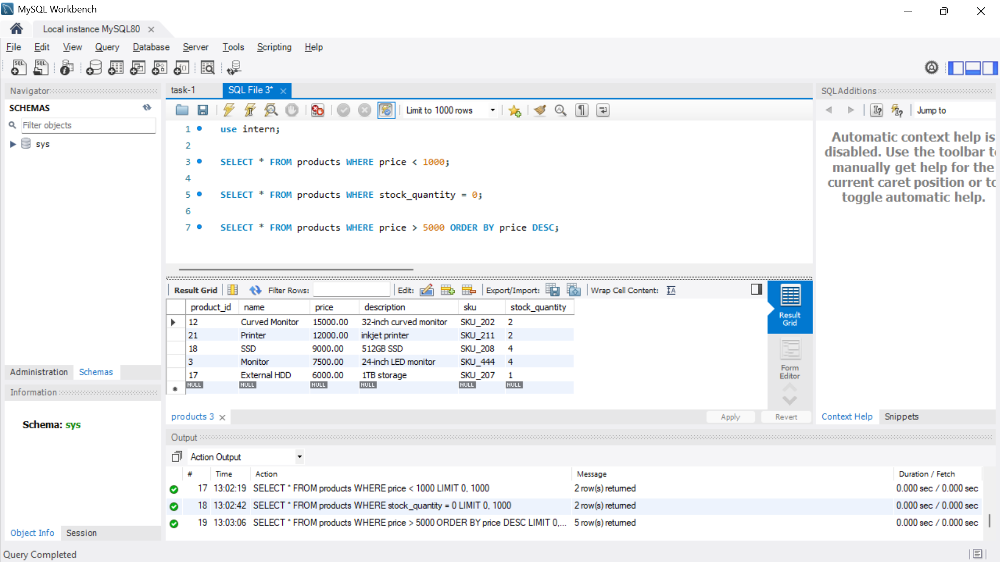
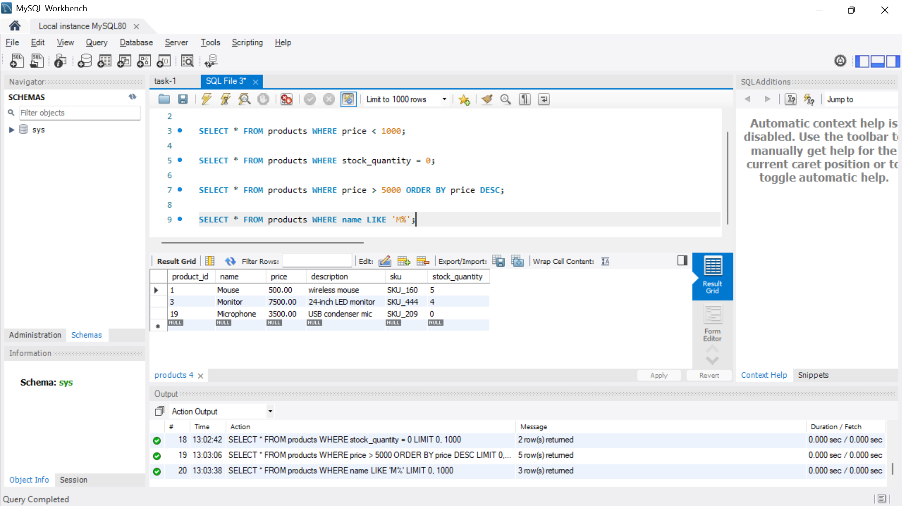
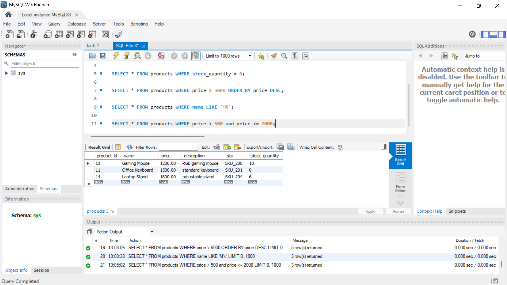
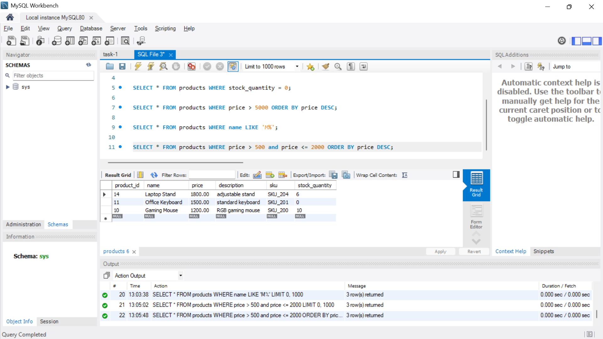
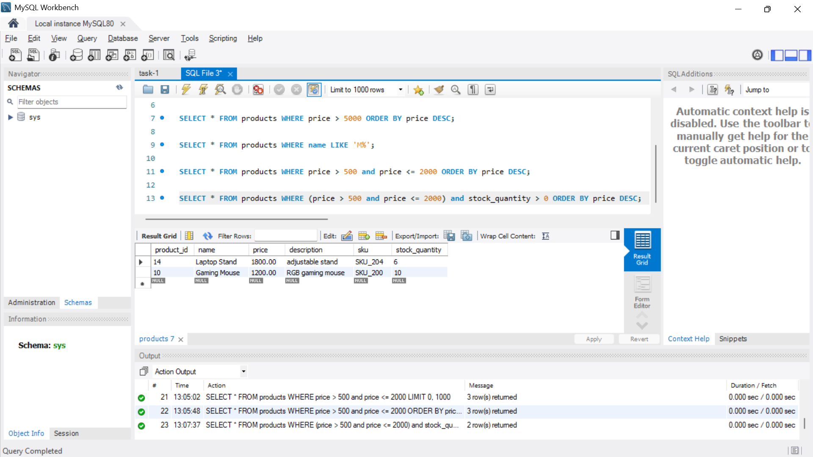

# Basic Filtering and Sorting
    
**Objective:**

- Write queries that filter records and sort the result set.

**Requirements:**

- Use the `WHERE` clause to filter records based on a condition (e.g., `WHERE Department = 'Sales'`).
- Apply the `ORDER BY` clause to sort the results (e.g., by `LastName` or `Salary`).
- Experiment with multiple conditions using `AND`/`OR`.

## Outputs

