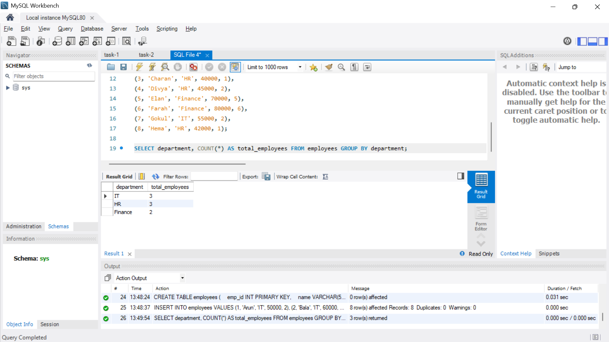
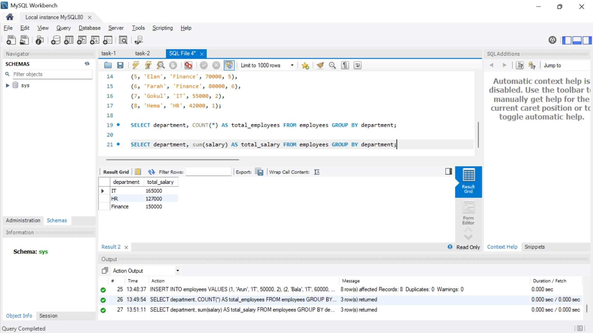
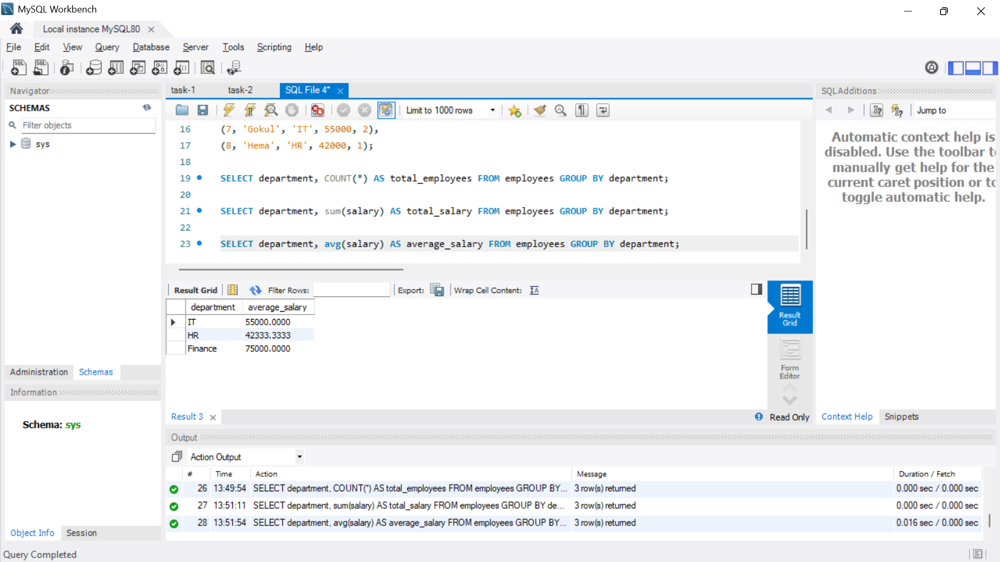
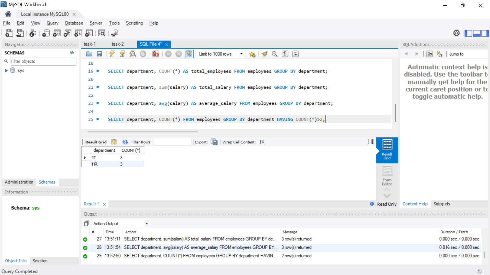

# Simple Aggregation and Grouping

**Objective:**

- Summarize data using aggregate functions and grouping.

**Requirements:**

- Write a query that uses aggregate functions such as `COUNT()`, `SUM()`, or `AVG()` to calculate totals or averages.
- Use the `GROUP BY` clause to aggregate data by a specific column (e.g., count the number of employees per department).
- Optionally, filter grouped results using the `HAVING` clause.

## Output 

