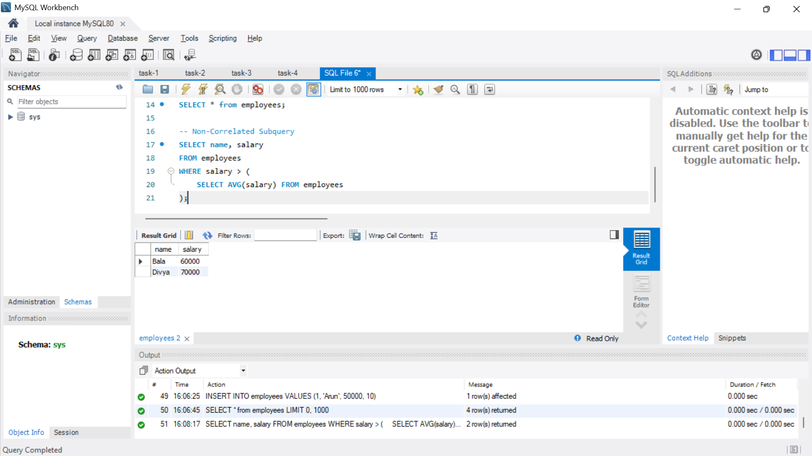
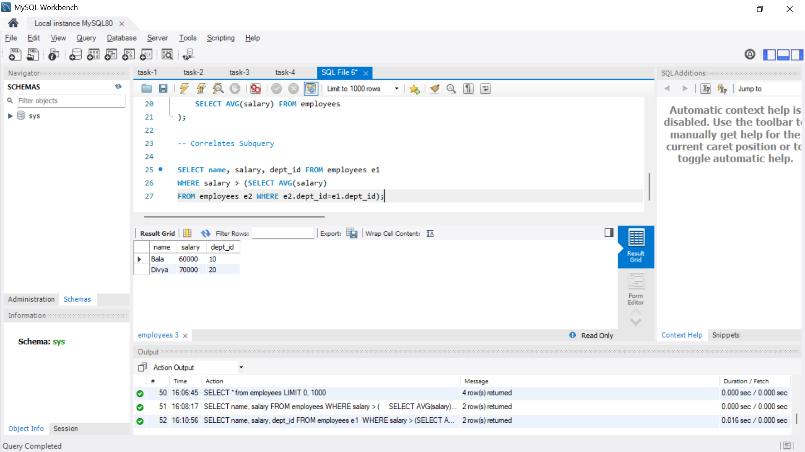
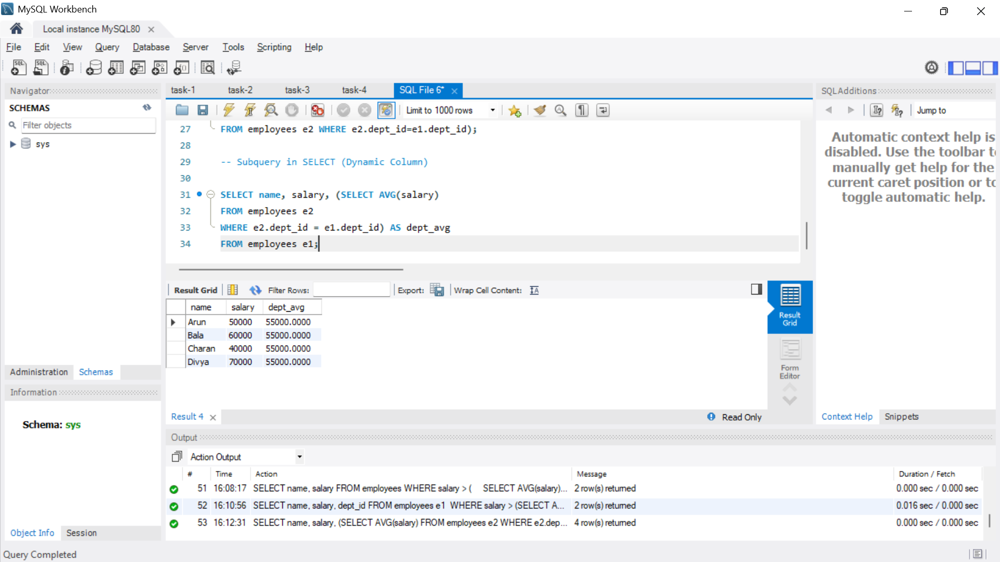

# Subqueries and Nested Queries

**Objective:**

- Use subqueries to filter or compute values within a main query.

**Requirements:**

- Write a query that uses a subquery in the `WHERE` clause (e.g., select employees whose salary is above the department’s average salary).
- Alternatively, use subqueries in the `SELECT` list to compute dynamic columns.
- Understand the difference between correlated and non-correlated subqueries.

## Output 

