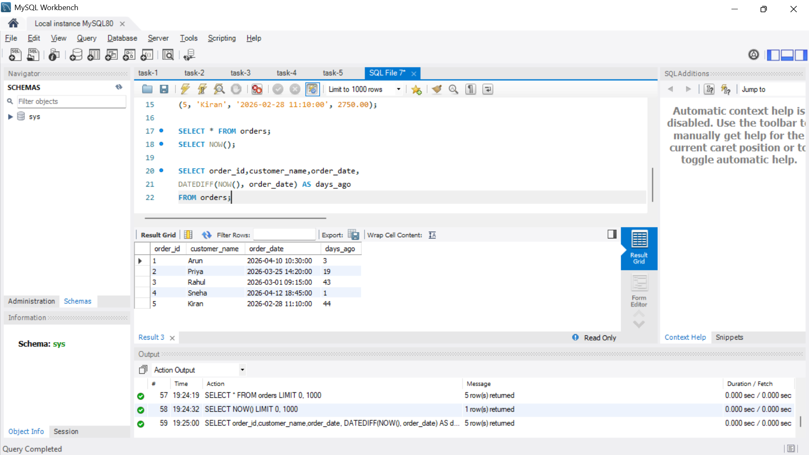
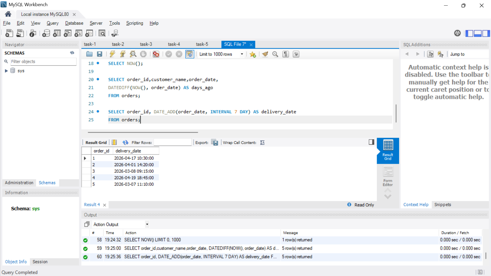
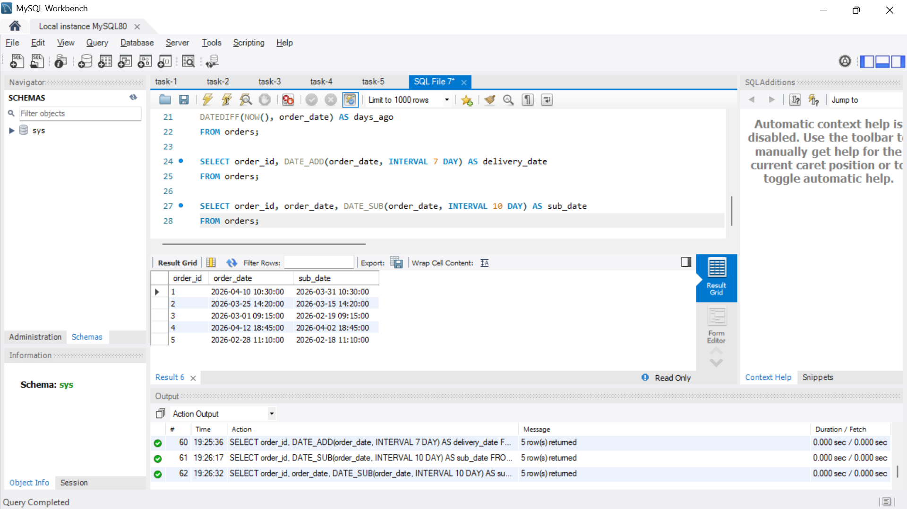
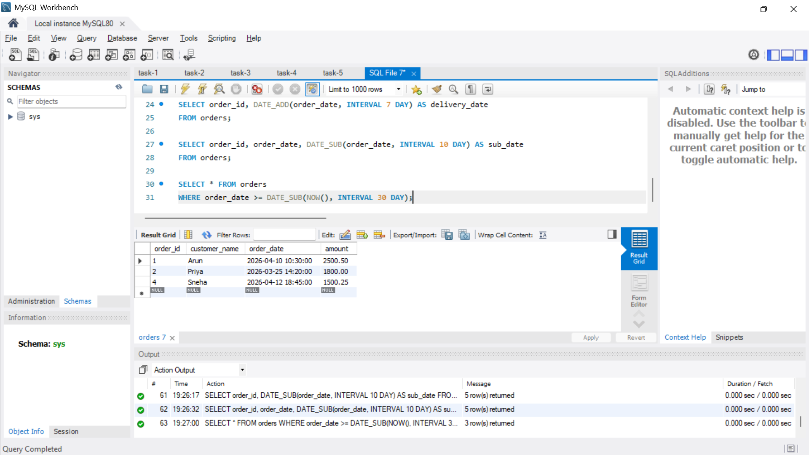
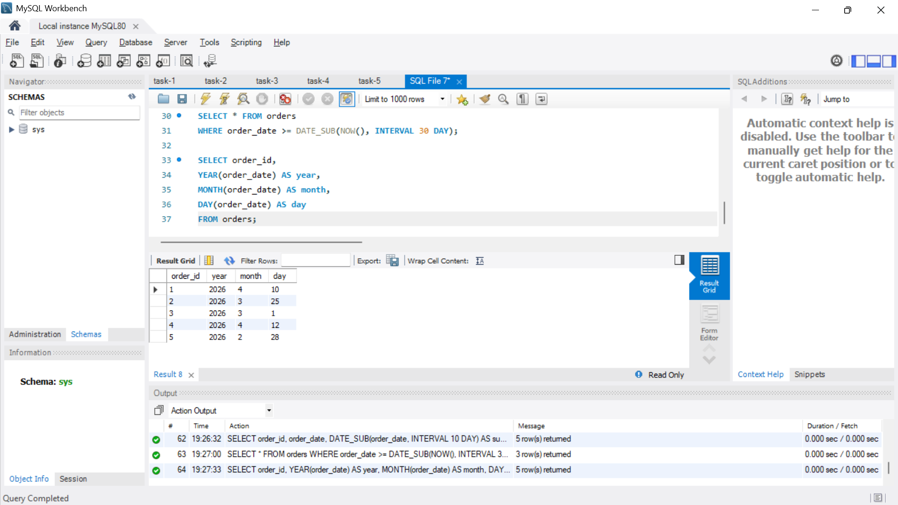
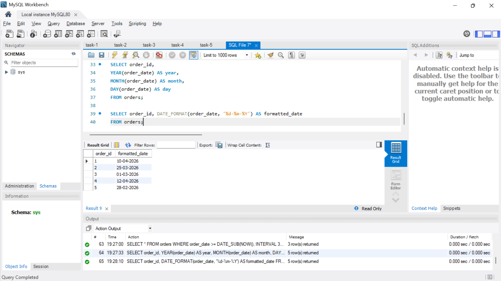

# Date and Time Functions

**Objective:**

- Manipulate and query data based on date and time values.

**Requirements:**

- Use built-in date functions (e.g., `DATEDIFF`, `DATEADD`, or your SQL dialect’s equivalent) to calculate intervals or adjust dates.
- Write a query to filter records based on date ranges (e.g., orders placed within the last 30 days).
- Format date outputs if necessary using functions like `CONVERT` or `TO_CHAR`.

## Output

