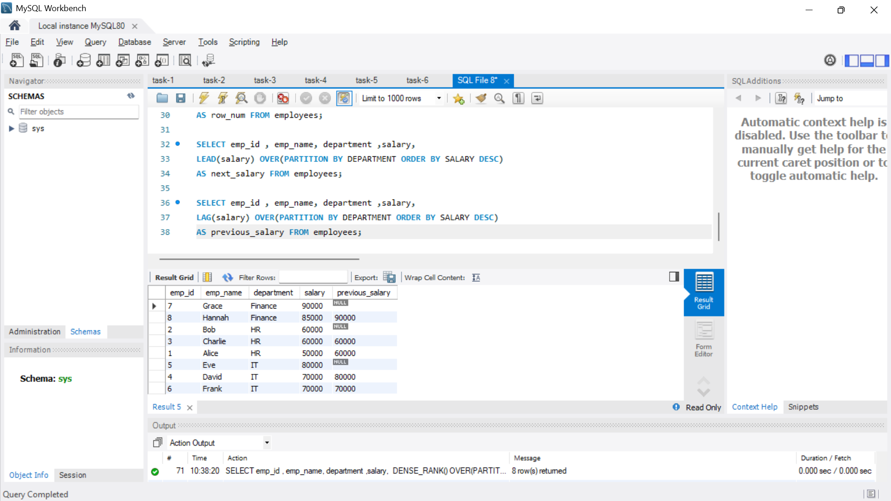
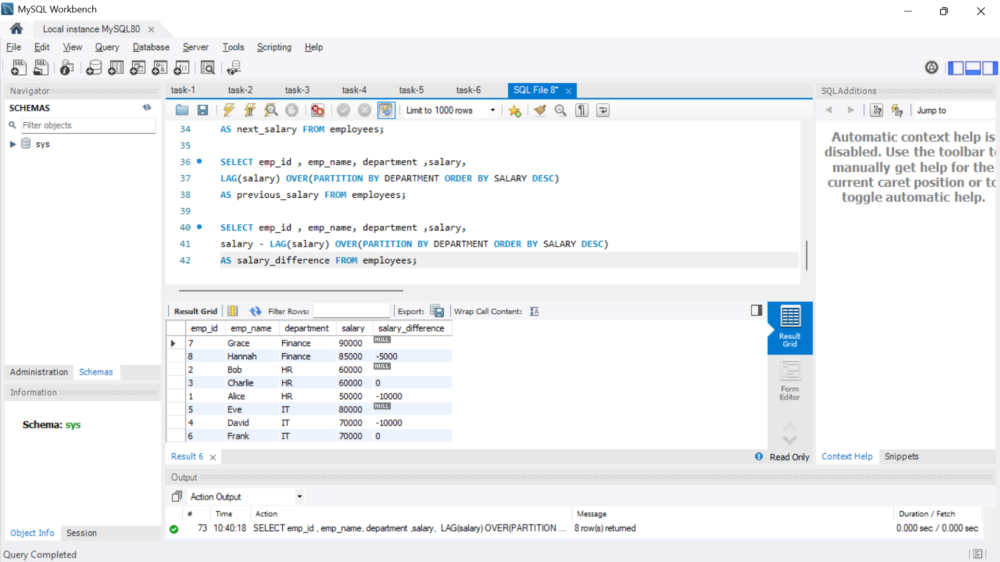
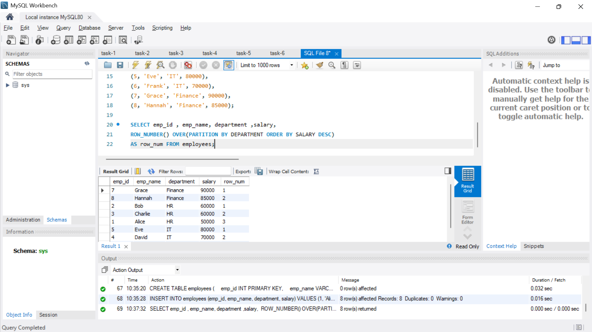
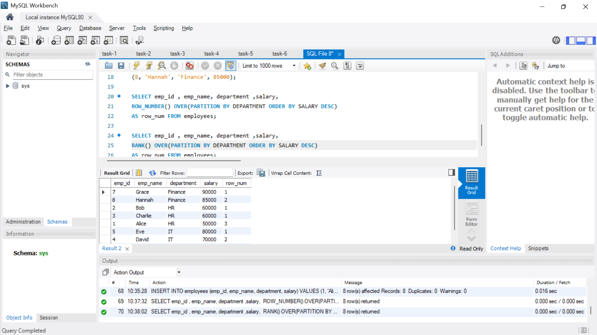
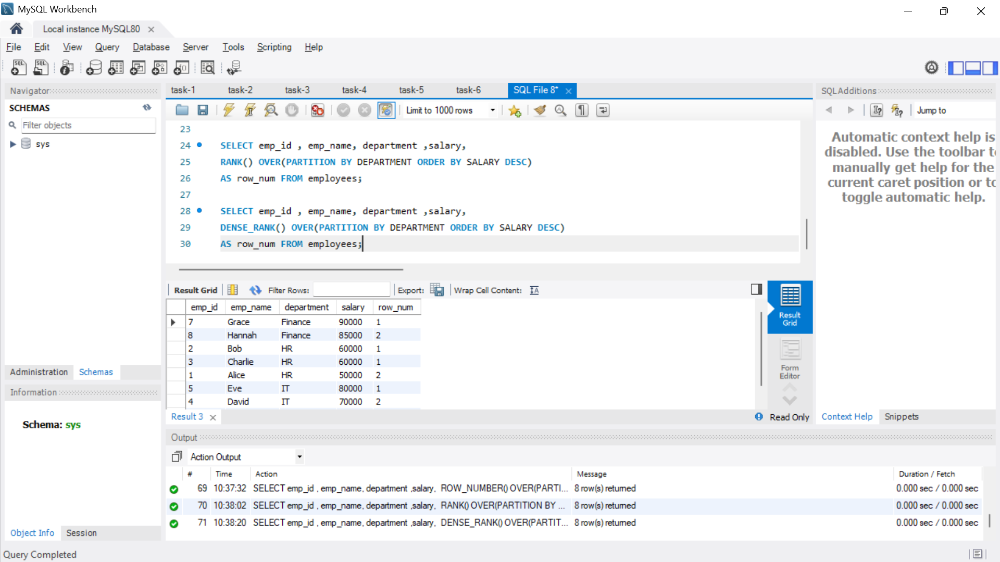
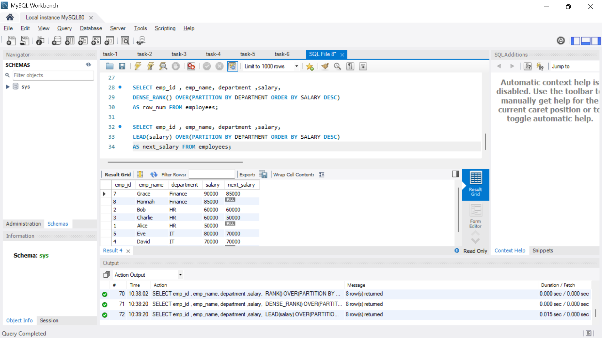

# Window Functions and Ranking

**Objective:**

- Leverage window functions to perform calculations across a set of rows.

**Requirements:**

- Write a query using window functions such as `ROW_NUMBER()`, `RANK()`, or `DENSE_RANK()` to assign ranks (e.g., rank employees by salary within each department).
- Use `PARTITION BY` to define groups and `ORDER BY` to specify the ranking order.
- Experiment with other window functions like `LEAD()` or `LAG()` to access adjacent row values.

## Output

