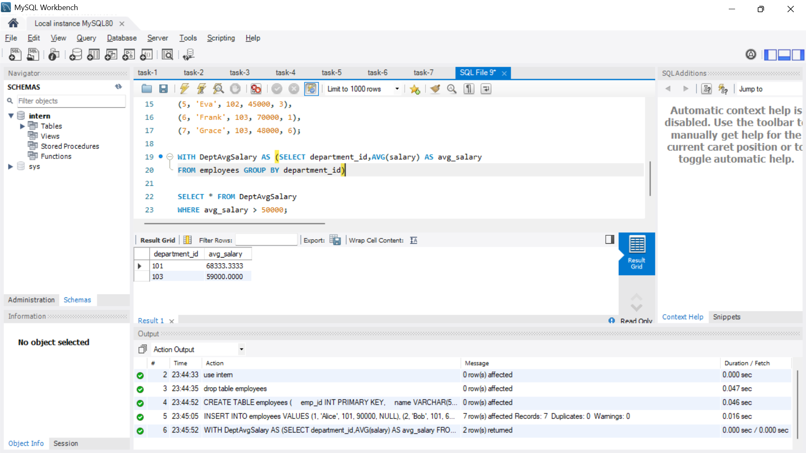
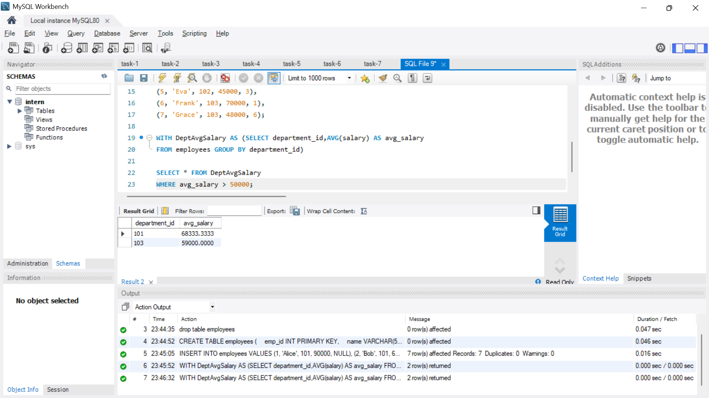
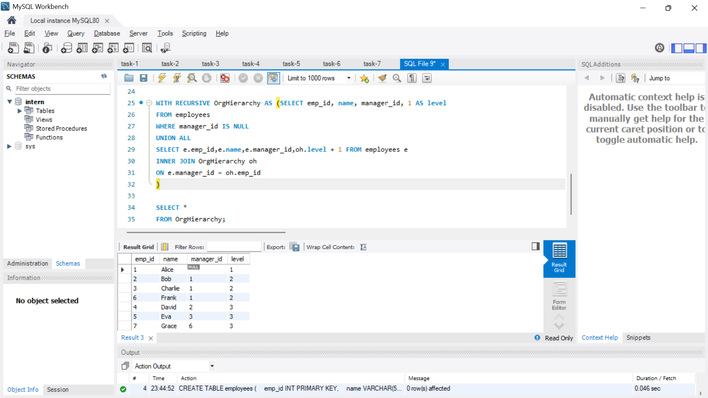
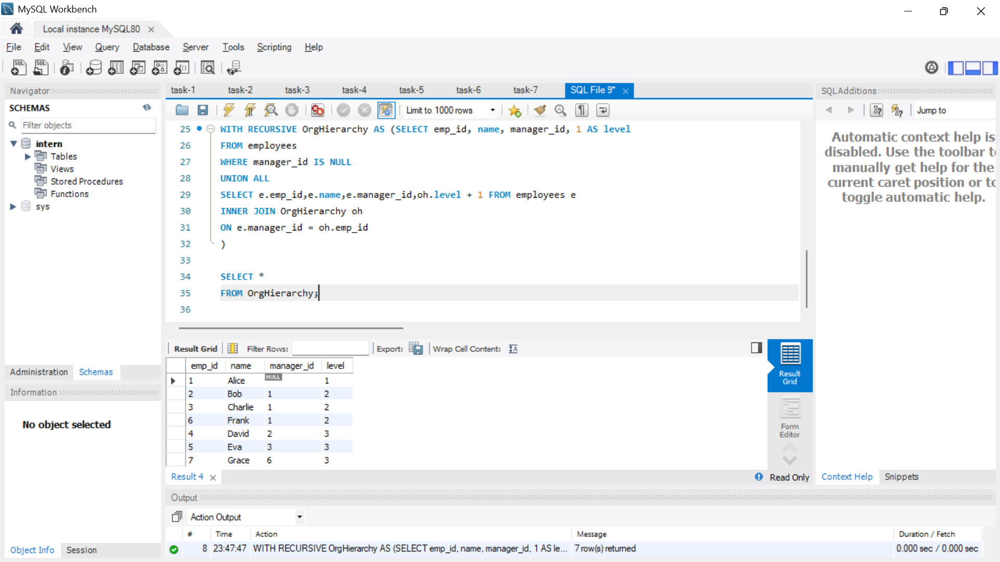

# Common Table Expressions (CTEs) and Recursive Queries

**Objective:**

- Simplify complex queries and process hierarchical data using CTEs.

**Requirements:**

- Write a non-recursive CTE to structure a multi-step query for readability (e.g., breaking down a complex aggregation).
- Create a recursive CTE to display hierarchical data (e.g., an organizational chart or a category tree).
- Ensure proper termination of the recursive CTE to avoid infinite loops.

## Output

